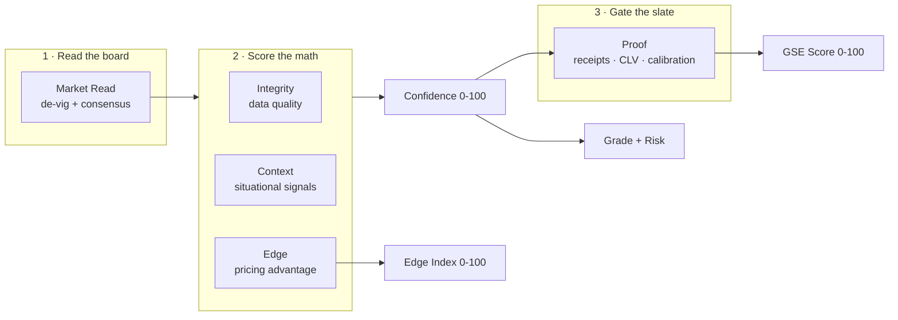
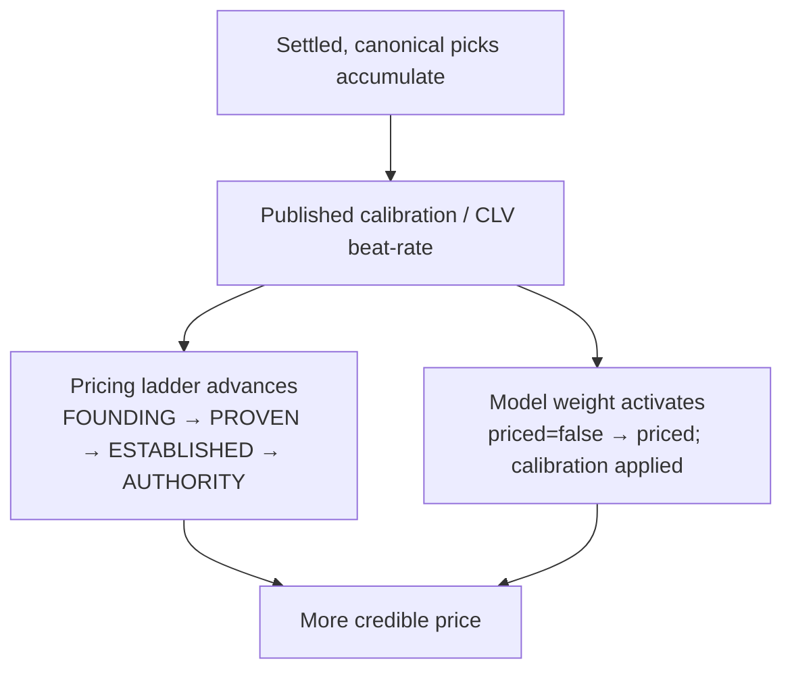

# Galaxy Sports Edge — System Compendium

**The whole platform on paper: every engine, faculty, and revenue surface — what it does, how it works, what data it takes in, what it produces, and whether it is live today or on the roadmap.**

- **Status:** living document. The methodology numbers are generated from a typed source of truth (`packages/prediction-engine/src/gse-method-spec.ts`) and enforced by a drift-guard test, so the figures in §1 cannot silently fall out of sync with the engine.
- **Model version:** `v5.0.0` · **GSE Score version:** `g1.0.0`
- **Companion artifacts:** the one-page summary (`docs/compendium/GSE_METHOD_ONE_PAGER.md`) and the public page (`/methodology`) are both derived from the same spec.
- **Voice:** analyst standard. No outcome is promised; every capability is labeled live-vs-roadmap; every number is traceable to a file.

---

## Table of contents

- [§0 Executive summary (one page)](#0-executive-summary)
- [§1 The GSE PRICE Method & the GSE Score](#1-the-gse-price-method--the-gse-score)
- [§2 Data ingestion](#2-data-ingestion)
- [§3 The prediction engine](#3-the-prediction-engine)
- [§4 Pipeline & workers](#4-pipeline--workers)
- [§5 Proof, calibration & integrity](#5-proof-calibration--integrity)
- [§6 Monetization & revenue](#6-monetization--revenue)
- [§7 Engagement, growth & content](#7-engagement-growth--content)
- [§8 Public surfaces](#8-public-surfaces)
- [§9 Trust & brand safety](#9-trust--brand-safety)
- [§10 Data model & types](#10-data-model--types)
- [§11 The one ladder](#11-the-one-ladder)
- [§12 Live-now vs. roadmap ledger](#12-live-now-vs-roadmap-ledger)
- [§13 Cross-references](#13-cross-references)

---

## §0 Executive summary

Galaxy Sports Edge (GSE) is a sports-intelligence platform. It ingests **real, licensed market data** (live sportsbook odds across seven sports), reads what the market actually believes once the bookmaker's cut is removed, scores every available matchup with a deterministic model, and **gates** the slate so only picks that clear quality and proof thresholds are published. The wedge product is sports betting intelligence; the moat is an **auditable track record** — tamper-evident receipts and pre-kickoff commitments that let a skeptic verify we did not edit a pick or hide a loser after the fact.

**The method has a name: the GSE PRICE Method.** Five pillars — **P**roof, **R**ead, **I**ntegrity, **C**ontext, **E**dge — run as a three-phase pipeline: *Read the board → Score the math → Gate the slate.* Each pillar maps 1:1 to code that already runs (§1).

**The flagship number is the GSE Score (0-100).** It is the live confidence score with one honest adjustment: a *provenance haircut* reflecting how provably we can stand behind the pick. It is a ranking/presentation index, **not** a win probability.

**Monetization is five-way** (§6): consumer subscriptions (live), creator tools, B2B widgets/API, affiliate commerce, and a trust toolkit. Pricing follows a **proof-gated ladder** — founding rates today, each step-up unlocked by a verified milestone, founding members grandfathered for life.

**The unifying insight (§11):** the *same* proof milestones gate both the pricing ladder *and* the activation of model weight. Engine maturity and revenue maturity are one ladder.

| What | Today |
|---|---|
| Picks scored from real licensed odds | **Live** |
| GSE Score / Edge Index / grade / risk | **Live** |
| Tamper-evident receipts + slate commitments | **Live** |
| Consumer subscriptions (Stripe, server-side gated) | **Live** |
| Independent edge engine (Kalshi/Elo/Poisson/ML) | **Surfaced, not yet priced** |
| Calibrated win probabilities | **Built, activates at sample ≥100** |
| Public performance/CLV stats | **Built, gate-held until enough settled picks** |
| Affiliate ledger, B2B API, real-time alerts, content auto-publish | **Built-not-wired / roadmap** |

---

## §1 The GSE PRICE Method & the GSE Score

### 1.1 The pipeline



### 1.2 The five pillars (PRICE)

Pipeline order is *Read → Score → Gate*; **PRICE** is the memory hook. Each maps 1:1 to real code (source: `gse-method-spec.ts → PRICE_PILLARS`).

| | Pillar | What it answers | What it is | Status |
|---|---|---|---|---|
| **P** | Proof | Can we prove it after the fact, without trust? | CLV, Wilson intervals, isotonic calibration, tamper-evident receipts, slate Merkle commitments, readiness gates, claim compiler | Live |
| **R** | Read | What does the market really believe, vig removed? | Shin de-vig + MEDIAN consensus + Market Gravity Index | Live |
| **I** | Integrity | Is the data good enough to act on? | Coverage + freshness + market breadth penalty; bootstrap→canonical gating | Live |
| **C** | Context | What situational signals reinforce or undercut the read? | Line movement, rest, ATS/H2H/venue form, cross-market, schedule stress, uncertainty | Live (ATS/H2H/venue gated) |
| **E** | Edge | How much pricing advantage is on the table? | Fair − offered → Edge Index; independent estimators surfaced but `priced=false` | Live (independents R&D) |

### 1.3 The confidence sum — exact formula

The published **confidence** (`scoring.ts:456-464`) is a deterministic sum of thirteen components plus a baseline, clamped to 0-100. Each component's range is encoded in `SCORE_COMPONENTS` and asserted equal to the real `WEIGHTS.*` constant by `gse-method-spec.test.ts`.

| # | Component | Pillar | Range | Source |
|---|---|---|---|---|
| 1 | Market consensus | R | 0 … +30 | `scoring.ts:185-219` |
| 2 | Market depth | R | 0 … +20 | `scoring.ts:225-242` |
| 3 | Edge (pricing advantage) | E | 0 … +25 | `scoring.ts:248-301` |
| 4 | Volatility penalty | I | −15 … 0 | `scoring.ts:307-343` |
| 5 | Line movement | C | −15 … +15 | `game-context.ts:58-118` |
| 6 | Rest advantage | C | −10 … +10 | `game-context.ts:129-180` |
| 7 | ATS form | C | −10 … +10 | `game-context.ts:191-245` (gated) |
| 8 | Data-quality penalty | I | −20 … 0 | `game-context.ts:260-307` |
| 9 | Head-to-head | C | −5 … +5 | `game-context.ts` (gated) |
| 10 | Venue form | C | −5 … +5 | `game-context.ts` (gated) |
| 11 | Uncertainty penalty | I | −8 … 0 | `game-context.ts` |
| 12 | Cross-market agreement | E | −3 … +4 | `game-context.ts` |
| 13 | Schedule stress | C | −5 … +5 | `game-context.ts` |
| — | Baseline | — | +10 | `scoring.ts:461` |

```
confidence = round( clamp(  Σ(components 1..13) + 10,  0, 100 ) )
```

**Supporting market math (Read pillar):**
- **De-vig** — Shin's method (`shin-devig.ts`) recovers fair probabilities from the over-round, correcting favorite–longshot bias; a `gotoConversion` alternative is available. A balanced `-110/-110` line de-vigs to 50/50 with a ~4.76% hold.
- **Consensus** — fair probabilities are taken to a **median across books** (`market-read.ts`), robust to a single outlier book.
- **Market Gravity Index (0-100)** = `round(conviction × quality × 100)`, where `conviction = min(1, 2·|p−0.5|)`, and `quality = 0.6 + 0.25·agreement + 0.15·liquidity` (`market-read.ts`).

**Edge Index (Edge pillar):** `edgeScore = clamp(round((edgeComponentScore / 25) × 100), 0, 100)` and the public Edge Index is `toEdgeIndex(edgeScore)` (`scoring.ts:54-79, 468`). A vanilla `-110/-110` market maps to an Edge Index of ~26; the de-vigged fair edge must be genuinely ≥ +5% to reach 100.

**Grade & tier (`constants.ts:13-18`):**

| Grade | Requires |
|---|---|
| ELITE_PLAY | confidence ≥ 85 **and** edge ≥ 80 |
| STRONG_PLAY | confidence ≥ 75 **and** edge ≥ 65 |
| SOLID_PLAY | confidence ≥ 65 **and** edge ≥ 50 |
| LEAN | below the above |

Publish floor: confidence ≥ **50** (`MIN_PUBLISH_CONFIDENCE`); PREMIUM at ≥ **70** (`PREMIUM_CONFIDENCE_THRESHOLD`). **Risk level** (`scoring.ts:85-108`): `LINE_STEAM` when |line move| ≥ 12; `HIGH_VARIANCE` when books < 3 or consensus < 0.58; `LOW_RISK` when consensus ≥ 0.70 and books ≥ 7; else `MODERATE`.

### 1.4 The flagship GSE Score (0-100)

Confidence already folds Read + Integrity + Context + Edge. It cannot contain the one thing the **Proof** pillar measures: *how provably we can stand behind this pick.* The GSE Score adds exactly that — and nothing else (`gse-score.ts`):

```
GSE Score (g1.0.0) = round( confidence × M )

M = 0.80 + 0.20 · P            // provenance multiplier ∈ [0.80, 1.00]
P (0..1) = (proof receipt frozen pre-kickoff      ? 0.34 : 0)
         + (included in a published slate commitment ? 0.33 : 0)
         + (canonical AND within freshness SLA       ? 0.33 : 0)   // capped at 1.0
```

A fully proven, slate-committed, canonical, fresh pick scores **M = 1.0 → GSE Score = confidence.** An unproven, bootstrap, or stale pick is gently discounted (down to 80% of confidence). This is **not double-counting**: provenance is orthogonal to the additive data-quality penalty inside confidence.

**Honesty labels (binding):** the GSE Score is a *heuristic ranking/presentation index, calibrated in direction* — never "X% to win." Confidence and Edge Index are its inputs and are always shown alongside it. A genuinely calibrated win probability appears only once `calibration-apply.ts` activates (sample ≥ 100, non-worsening ECE).

The flagship always travels as a **GSE Score Card** (`buildGseScoreCard`): `{ gseScore, confidence, edgeIndex, grade, riskLevel, publishTier, credibility, multiplier, proof, scoreVersion, modelVersion }`.

### 1.5 Worked example (verified by `gse-score.test.ts`)

A SPREAD pick scored with **confidence 78**, **edgeScore 64** (Edge Index 64). `computePickGrade(78, 64)` → **SOLID_PLAY** (78 ≥ 65 and 64 ≥ 50, but 64 < 65 so not STRONG). Confidence 78 ≥ 70 → **publishTier PREMIUM**. Risk **MODERATE**.

| Provenance state | P | M | **GSE Score** |
|---|---|---|---|
| Receipt **+** slate commitment **+** canonical & fresh | 1.00 | 1.00 | **78** |
| Receipt only | 0.34 | 0.868 | **68** (`round(78 × 0.868)`) |
| Unproven / bootstrap / stale | 0.00 | 0.80 | **62** (`round(78 × 0.80)`) |

The card shows all three of GSE Score, confidence (78), and Edge Index (64) together — the haircut is visible, never hidden.

---

## §2 Data ingestion

All facts come from real sources; the platform never fabricates data. Ingestion lives in `packages/data-ingestion/` and `packages/ingestion-pipeline/`; rights are gated by `apps/web/lib/scraping/`.

| Faculty | File | Data in → out | Status |
|---|---|---|---|
| The Odds API client | `odds-api-client.ts` | sport key → `OddsApiEvent[]` (h2h/spreads/totals across books) | **Live** — primary source |
| Kalshi client | `kalshi-client.ts` | game ticker → `KalshiFairValue` (independent exchange fair prob) | **Surfaced, priced=false** |
| nflverse source | `nflverse-source.ts` | dataset/season → CSV tables (PBP, injuries, stats); CC-BY-4.0 | **Persisted, not scored** |
| ESPN results | `espn-results-client.ts` | sport/date → final scores (settlement only) | **Live** |
| Team-rates source | `team-rates-source.ts` | sport → `TeamScoringRecord[]` | **R&D / blocked** (Poisson guard) |
| Reddit narrative | `reddit-narrative-source.ts` | athlete/themes → `NarrativeSignal` | **Shadow** (`BLOCKED_MISSING_SOURCE`) |
| OpenFootball fixtures | `openfootball-source.ts` | sport/season → fixtures | **R&D** (ESPN primary) |
| Normalizer | `normalizer.ts` | raw book odds → `NormalizedOdds` | **Live** (mandatory step) |
| Context enrichment | `context-enrichment.ts` | history → `GameContextInput` (rest, line movement, ATS, schedule) | **Live** |
| Source registry / health / failover | `source-registry.ts`, `source-health.ts`, `odds-failover.ts`, `fetch-failover.ts` | provider config → freshness SLAs, failover chains | **Live** |

**Rights gating (CLAUDE.md posture):** every extraction passes the **Scraping Clearance Engine** (`apps/web/lib/scraping/clearance-engine.ts`); an `allowed=false` result stops the job, and every extracted record carries a point-in-time `RightsSnapshot`. The **Source Rights Registry** (`source-rights-registry.ts`) classifies each source (e.g. `approved_api`, `approved_open_license`, `permission_required`, `excluded`). Facts (scores, standings, fixtures, timestamps, URLs, metadata, derived signals) may be extracted; article bodies, proprietary predictions, protected graphics, and account-gated content may not.

---

## §3 The prediction engine

Every module under `packages/prediction-engine/src/`. **Live** = priced into the published score; **R&D** = built, surfaced or shadowed, weight 0.

**Core scoring & market read (Live):** `scoring.ts` (orchestrates the 13-component confidence, Edge Index, grade, risk → `ScoredPick`), `game-context.ts` (situational signal computation), `shin-devig.ts` (de-vig), `market-read.ts` (consensus + Market Gravity), `consensus.ts` / `consensus-view.ts` (agreement metrics), `composite-score.ts`.

**Methodology layer (Live, new):** `gse-method-spec.ts` (typed source of truth for pillars/components/score/roadmap), `gse-score.ts` (flagship GSE Score + Score Card).

**Independent edge (R&D / `priced=false`):** `edge-engine.ts` (compares independent estimators to the book's fair value; `SPEAK=+2.5%`, `LEAN=+1.2%`), `team-rates.ts` + `poisson.ts` (Poisson fair value; blocked by `assertTeamRatesAvailable`), `elo-backtest.ts` / `elo-estimator.ts`, `ml-estimator.ts` (GBM scaffold + honesty gate), `opponent-adjusted.ts`, `edge-significance.ts`.

**Conviction & calibration (R&D / gated):** `conviction-tier.ts` (honest "70% tier" — needs calibrated P + CLV history), `calibration-apply.ts` (confidence → calibrated probability; self-suppresses until sample exists), `calibration-drift.ts`, `probability-calibration.ts` (isotonic/PAVA, Brier decomposition, ECE, reliability curve).

**CLV & settlement (Live):** `clv.ts` (spread/total/moneyline CLV → `BEAT_CLOSE | MATCHED_CLOSE | LOST_TO_CLOSE`), `clv-capture.ts` (derive closing line from odds history and grade), `settlement.ts` (`WIN | LOSS | PUSH | VOID`).

**Proof spine (Live):** `proof-of-record.ts` (Merkle: canonical payload, leaf hash, inclusion proof), `pick-proof-receipt.ts` (tamper-evident per-pick commitment), `slate-commitment.ts` (pre-kickoff Merkle root over the whole slate — kills cherry-picking).

**Signals, provenance, limits (Live/analytics):** `signal-snapshot.ts`, `signal-ledger.ts`, `provenance.ts`, `evidence-readiness-matrix.ts`, `model-limitations.ts` (incl. `wilsonInterval`), `trend-discovery.ts`, `performance-analytics.ts`.

**Gating & config (Live):** `constants.ts` (`MODEL_VERSION`, `WEIGHTS`, thresholds), `platform-config.ts` (maturity flags), `readiness.ts` (runtime gate decisions + `bootstrapGateResponse`).

**Bankroll & player models (R&D):** `kelly.ts` (quarter-Kelly stake info, capped at 3 units), `bankroll.ts`, `contest-scoring.ts`, `player-projection.ts`, `player-archetype.ts`, `player-rush-scheme.ts`, `responsible-gaming.ts`.

---

## §4 Pipeline & workers

**Single source of truth for generation/settlement** (`packages/ingestion-pipeline/src/`):
- `process-sport.ts → processSport()` — the canonical pick-generation path (called by both the worker and the admin trigger, so they cannot diverge): fetch odds → normalize/upsert → enrich context → apply gates (`canUseDerivedHistory`) → `scoreGames()` → upsert picks + capture `PickSignalSnapshot` → build `PickProofReceipt` + `SlateCommitment`.
- `settle-sport.ts → settleSport()` — fetch final scores → match picks → grade CLV → write results + `eligibleForLearning` → grade `LossAutopsy`.
- `source-snapshot.ts`, `settlement-snapshots.ts` — forensic capture of raw provider responses (payload + hash).

**Workers** (`workers/`):

| Worker | Cadence / state | Consumes → produces |
|---|---|---|
| `data-refresh` | every ~30 min (**Live**) | in-season sports → fresh picks + settlements |
| `pick-generation` | **legacy** (folded into data-refresh) | — |
| `content-publishing` | **kill switch ON** (`INTERNAL_CALIBRATION_ONLY` default) | drafts only; never auto-publishes |
| `airwave-listener` | **R&D** (not deployed) | future real-time market-movement listener |

**Bootstrap → canonical ladder** (`platform-config.ts` flags): `PUBLIC_PICKS_ENABLED` → `CANONICAL_HISTORY_ENABLED` → `DERIVED_MODEL_HISTORY_ENABLED` (ATS/H2H/venue) → `OUTCOME_LEARNING_ENABLED` → `FEATURED_PICK_PROMOTION_ENABLED` → `PERFORMANCE_STATS_ENABLED`.

---

## §5 Proof, calibration & integrity

| Faculty | File | Data in → out | Status |
|---|---|---|---|
| Pick proof receipt | `pick-proof-receipt.ts` | committed pick fields → SHA-256 receipt (re-derivable, tamper-evident) | **Live** |
| Slate commitment | `slate-commitment.ts` | all pre-kickoff receipts → Merkle root + fixed count; inclusion proofs | **Live** |
| Proof of record | `proof-of-record.ts` | leaves → canonical payload, root, inclusion proof, verify | **Live** |
| CLV capture | `clv-capture.ts` / `clv.ts` | entry line + closing snapshot → CLV verdict | **Live** |
| CLV coverage / segments / anchor | `apps/web/lib/performance/*` | settled picks → coverage %, segment breakdowns, anchor validity | **Live (analytics)** |
| Wilson interval | `apps/web/lib/performance/wilson-interval.ts`, `model-limitations.ts` | wins/total → 95% CI on win rate | **Live** |
| Public CLV policy | `apps/web/lib/performance/public-clv-policy.ts` | graded picks → publishable? (beat-rate + sample floor) | **Live (gate)** |
| Calibration metrics | `apps/web/lib/calibration/*`, `probability-calibration.ts` | settled picks → Brier, ECE, reliability curve | **Live (compute) / R&D (apply)** |
| Readiness gates | `readiness.ts` | platform config → runtime allow/deny + bootstrap response | **Live** |
| Integrity ledger | `apps/web/lib/platform/integrity-ledger.ts` | every score/settlement/claim → append-only audit trail | **Live** |
| Public-claim compiler | `apps/web/lib/claims/public-claim-compiler.ts` | claim context → ALLOW/BLOCK + blockers | **Live** |

---

## §6 Monetization & revenue

### 6.1 The proof-gated pricing ladder

Single source of truth: `apps/web/lib/pricing/pricing-phases.ts`. Prices rise only when proof justifies it; subscribers are grandfathered at their entry-phase rate for life (`GRANDFATHER_GUARANTEE`).

| Phase | Trigger | Pro | Elite |
|---|---|---|---|
| **FOUNDING** (live) | bootstrap | $14.99/mo · $99/yr | $24.99/mo · $179/yr |
| **PROVEN** | ≥100 settled + published calibration | step-up | step-up |
| **ESTABLISHED** | ≥500 settled + CLV beat ≥52.4% | step-up | step-up |
| **AUTHORITY** | ≥2000 settled + CLV beat ≥55% | step-up | step-up |

Helpers: `getCurrentPricingPhase()`, `annualSavingsPct()`, `annualMonthlyEquivalent()`, and `phase-readiness.ts → evaluatePhaseAdvance()` (advisory eligibility — no auto-advance). Founding tiers: **Free** (1-2 picks/day, public calibration), **Pro** (all picks, confidence, factor trail, line movement, 7 sports), **Elite** (Pro + real-time alerts + CLV ledger).

### 6.2 Value & feature gates
`value-architecture.ts` maps each tier to plain-English promises and upsells; `feature-gates.ts` maps 25+ features to a minimum tier, build status, and how each appears to below-tier users (`open | teaser | blurred | hidden`). `isFeatureUnlocked(tier, key)` is the single check.

### 6.3 Stripe
`stripe.ts` (SDK init, price-ID map from env, `getOrCreateStripeCustomer`, `createCheckoutSession`, `createPortalSession`; display prices **always** derive from the pricing phase — never hardcoded). Routes: `POST /api/subscriptions/checkout`, `POST /api/subscriptions/portal`, `POST /api/webhooks/stripe` (signature-verified, idempotent via `WebhookEvent.stripeEventId`, syncs subscription state, stamps `pastDueSince` for the grace window).

### 6.4 Server-side entitlements (no frontend-only paywalls)
`entitlements.ts → getUserEntitlements(userId)` (resolves subscription, enforces a 7-day `PAST_DUE` grace window, fails closed to FREE), `api-entitlement.ts → gateApi()/requirePremiumApi()` (401/403), `pricing/tier-access.ts → getViewerEntitlements()`, and the pure `getEntitlements(tier)` in `@sports/types`. Paywall UI is server-rendered **in place of** gated content (`tier-gate-panel.tsx`) so gated data is never sent to the client.

### 6.5 Affiliate ledger (built, not wired)
`apps/web/lib/affiliate/ledger.ts` — pure double-entry accounting: `accrueCommission`, `clawbackCommission` (refund/chargeback reversal), `recordPayout` (validated against cleared payable), `summarizeAffiliate`, `auditLedger`. Hold windows cover the refund period; crypto cashout and ad-pixel attribution are deliberately excluded for trust/compliance.

### 6.6 The five-way monetization map (`docs/product/monetization-map.md`)
One unit of intelligence monetizes five ways: **(1)** consumer subscription (**live**), **(2)** creator tools (Phase 3), **(3)** B2B widgets + API (Phase 5; `apps/web/lib/b2b/api-governance.ts` already governs key/domain/quota/claim-safety), **(4)** affiliate & sportsbook commerce (Phase 4), **(5)** trust toolkit licensing (Phase 5). Free forever: public Edge Index, methodology, calibration, model changelog, loss room.

---

## §7 Engagement, growth & content

| Faculty | File | Data in → out | Status |
|---|---|---|---|
| SEO / schema.org | `apps/web/lib/seo/sports-jsonld.ts` | matchup → metadata + `SportsEvent`/FAQ/Breadcrumb JSON-LD | **Live** |
| Content workflow | `apps/web/lib/content/workflow.ts` | content kind + source coverage → `canApprove` + blockers | **Live (gates)** |
| Content engine | `apps/web/lib/content-engine/*` | pick data → draft (pure, testable, no auto-publish) | **Live** |
| Content generator | `apps/web/lib/content-generator.ts` | data → Claude-written narrative (never picks; disclaimer + banned-phrase scan + budget) | **Live (gated)** |
| Glass Box Cipher | `apps/web/lib/cipher/cipher.ts`, `components/cipher/*`, `/api/cipher/verify` | weekly shards → answer hash; founder-gated reward pool | **Live** |
| Reader register | `apps/web/lib/reader-register/*` | reader choice → explanation style (localStorage) | **Live** |
| Analytics funnel | `apps/web/lib/analytics/events.ts` | typed funnel events → no-op until a provider is wired | **Instrumented, no provider** |
| Jarvis alerts | `apps/web/lib/cockpit/jarvis-alerts.ts` | platform diff → operator alerts (severity info/warning/page) | **Live (no delivery)** |
| Real-time email & push alerts (Elite) | — | per-signal alerts | **Roadmap** |

### Engagement loop — the Glass Box Cipher
A weekly hidden puzzle: shards are scattered across live pages during a 3.5-day window (Mon-Thu ET), players assemble the answer, and a founder-gated reward (pre-provisioned Stripe coupon pool) is dispensed. Verification (`/api/cipher/verify`) is server-side: SHA-256 with a timing-safe compare, per-IP rate limiting, and no plaintext answer ever sent to the client. The shard *values* are server-only; only labels and clues reach the browser.

---

## §8 Public surfaces

Every page renders real data and fails to an honest bootstrap state (never a fabricated number) when a gate is closed.

| Route | Shows | Source | Gate |
|---|---|---|---|
| `/` | Live board telemetry, calibration, data-source stack, world sections | `loadBoardState`, `loadPublicCalibrationReport` | none |
| `/board` | Scoring/published/gated picks today | `loadBoardState`, `loadBoardPasses` | none (force-dynamic) |
| `/observatory` | Market fair board, line shop, simulation cloud, slate twin | line-movement reads | `canExposePerformanceStats` (bootstrap-aware) |
| `/proof` | Every settled pick's Merkle hash + CLV + consensus | `Pick` + proof spine | none |
| `/performance` | Win/loss/push, per-sport/tier, calibration | `PerformanceSummary` | `canExposePerformanceStats` |
| `/clv` | Beat-the-close stats + glossary | `loadPublicClvPolicy` | `canExposePerformanceStats` |
| `/pricing` | Founding rates, feature matrix, money-back window | `pricing-phases`, `feature-gates` | none |
| `/methodology` | The PRICE Method, the GSE Score, factor inventory, changelog | `gse-method-spec.ts` | none |
| `/accountability` | Loss autopsies, calibration, changelog links | links | none |
| `/academy` | Betting-education curriculum | course modules | Free |
| `/brief` | Today's pick count + responsible-play note (stub) | brief composer | perf gate for details |
| `/blog` | Pre-game reads (excerpt free, full Pro+) | `BlogPost` | `canPublishContent` |
| `/cipher` | Weekly puzzle hunt | `cipher.ts` | open (reward founder-gated) |

---

## §9 Trust & brand safety

The public surface may only assert language that maps to an APPROVED entry in the **Trust Claim Registry** (`apps/web/lib/trust-claims.ts`). Claims are `APPROVED` (safe), `GATED` (safe only when a readiness gate is true), or `BANNED` (never). The registry is the single source of truth for `scanForBannedPhrases`, which every public-copy test consumes.

Banned terms (a serious sports product never implies certainty in an uncertain domain). The exact list lives in the registry; representative entries:

```
guaranteed · lock · sure thing · risk-free · easy money · can't lose ·
verified track record · thousands of bettors · trusted by serious bettors · guaranteed profit
```

Layered enforcement:
- **`public-claim-compiler.ts`** — every public number passes eight gates (banned phrases, performance readiness, bootstrap status, settled-sample floor, model-version stamp, data freshness, CLV coverage, calibration publishable) → `ALLOW | BLOCK` with explicit blockers.
- **`apps/web/lib/safety/content-safety.ts`** — brand-safety lexicon (sexual/hate → block; profanity/violence/self-harm/PII/overclaim → review).
- **Glossary** (`apps/web/lib/glossary.ts`) — every branded term explained in one jargon-free sentence (includes `gseScore`, `gseMethod`).
- **`RiskDisclosure`** — standardized real-risk + responsible-play copy, rendered on every major public page.

Tests scan the highest-stakes pages and customer-facing docs (including this compendium) for banned phrases; legitimate references to a forbidden term are wrapped in code spans, which the scanner strips.

---

## §10 Data model & types

**Prisma models** (`packages/db/prisma/schema.prisma`) — one line each:
- *Auth/billing:* `User`, `Subscription` (tier/status/Stripe/grace anchor), `WebhookEvent`, `Account`, `Session`, `VerificationToken`.
- *Sports context:* `Sport`, `League`, `Team`, `Game`, `Odds`, `OpeningLine`, `TeamGameLog`.
- *Picks:* `Pick` (the central record), `PickProofReceipt`, `PickSignalSnapshot` (immutable signal capture + `eligibleForLearning`), `GateDecision`.
- *Proof/accountability:* `SlateCommitment`, `LossAutopsy`.
- *Signals/ingestion:* `SourceSnapshot`, `GameSignal`, `IngestionRun`.
- *Content:* `BlogPost`, `CreatorAsset`, `ModelJournalEntry`, `DailyBrief`, `Promotion`, `SourceCoverageReport`.
- *Operator cockpit:* `CockpitTask`, `CockpitDecision`, `CockpitMediaItem`, `JarvisMemoryEvent`, `JarvisDecision`, `AgentHandoff`, `SubagentRun`.
- *Analytics/budget:* `PerformanceSummary`, `ClaudeApiCallRecord`, `ClaudeApiBudget`, `CalibrationProposal`.

**Shared types** (`packages/types/src/index.ts`): `SubscriptionTier`, `PickType/Tier/Grade`, `RiskLevel`, `PickResult`, `Entitlements` + `getEntitlements()`, `FactorBreakdown` + `FactorDetail`, `IndependentEdgeSummary` (`priced` flag), `ScoredPick`, `PublicPick`, `AuditPayload`, `GameContextInput`, `SignalCategory`, `NarrativeSignal`.

---

## §11 The one ladder

The platform's most important structural fact: **the same proof milestones gate both pricing and model weight.** A settled, calibrated track record is simultaneously (a) what unlocks the next pricing rung and (b) what unlocks turning a surfaced-but-unpriced signal into a priced one.



Concretely: the **PROVEN** rung (≥100 settled + published calibration) is the same threshold at which `calibration-apply.ts` can begin emitting real probabilities and `PERFORMANCE_STATS_ENABLED` can open. Revenue maturity and engine maturity are not two roadmaps — they are one, gated by the same evidence.

---

## §12 Live-now vs. roadmap ledger

Generated from `gse-method-spec.ts → LIVE_VS_ROADMAP`.

| Capability | Status | Detail |
|---|---|---|
| Consensus, depth, book-edge, line movement, rest, schedule, cross-market, uncertainty | **PRICED** | Summed into published confidence today |
| ATS form, head-to-head, venue form | **PRICED (gated)** | Live once `DERIVED_MODEL_HISTORY_ENABLED`; gated until canonical history exists |
| Independent Edge Engine (Kalshi) | **SURFACED, UNPRICED** | Shown in the glass box; weight 0 until a founder-gated `MODEL_VERSION` step |
| Probability calibration (isotonic/Brier/ECE) | **BUILT, NOT WIRED** | Activates at sample ≥100 with non-worsening ECE; never shown as a probability before then |
| Poisson estimator | **R&D, BLOCKED** | Refuses to run without real team rates (no fabricated λ) |
| Elo / ML estimators | **R&D, BLOCKED** | Measurement/scaffold only until calibration proves them |
| Public performance & CLV stats | **BUILT, GATE-HELD** | Gated by `PERFORMANCE_STATS_ENABLED` + settled-sample floor; bootstrap picks excluded |
| Affiliate payout ledger | **BUILT, NOT WIRED** | Double-entry complete and tested; activation is a deliberate later step |
| Real-time email & push alerts (Elite) | **PLANNED** | Described in the tier matrix; delivery not yet implemented |
| Content auto-publish | **BUILT, NOT WIRED** | Drafts + gates exist; worker ships with a hard kill switch ON |

---

## §13 Cross-references

This compendium consolidates and indexes; it supersedes none of:
- `docs/prediction-engine.md` — engine deep-dive
- `docs/evidence-engine.md` — evidence/provenance deep-dive
- `docs/product/monetization-map.md` — the five-way monetization frame
- `COMPETITIVE_PRICING_AND_PACKAGING.md` — pricing decision record
- `CLAUDE.md` — non-negotiable rules + scraping posture

*Past performance does not guarantee future results. Sports wagering is real risk; if you or someone you know has a gambling problem, call 1-800-GAMBLER.*
