# Sitemap and route-to-destination mapping

Input for the founder's redesign brief (`8970241d-claudedesignprompt.md`), deliverable list in
§9: "Sitemap and route-to-destination mapping for all 236 existing pages."

Method: every `page.tsx` under `apps/web/app` was enumerated with `find apps/web/app -name
page.tsx` (236 files, matching the brief's count). The URL path is the file path with
`apps/web/app` and `/page.tsx` stripped; the repo has no route groups in parentheses, so no path
needed that extra step. Purpose comes from each file's `metadata.title`, its first `<h1>`, its
`<Shell title="...">` prop, or a code comment, checked with grep, not a full read of every file.
Where none of those gave a clear answer the purpose says so plainly. Access level and destination
follow the rules in the brief's §4 (quoted where the brief names a route explicitly) or a stated
judgment call where it does not.

No performance numbers appear anywhere in this document.

## (a) Summary: routes per destination

| Destination | Routes | What it means |
|---|---|---|
| Today | 8 | the live board and same-day content; `/picks` and `/board` are named in brief §4 |
| Redirect/merge | 19 | existing routes the brief's IA folds into one other page (see breakdown below) |
| How it works | 21 | the factor model, data sources, pricing rationale, free tools |
| Fantasy | 20 | projections, start-sit, draft tools, DFS |
| Stats | 68 | StatKing facts, weather, trends, media, player and team intelligence |
| Utility rail | 4 | Pricing, Sign in, Account (Search has no existing page, see open decisions) |
| Footer-only | 20 | legal, responsible play, about, contact, and other content not in primary nav |
| Internal | 75 | `/admin/*` (40) and `/cockpit/*` (35); never in public nav |
| Home | 1 | the root `/`, its own screen per brief §8.1, not one of the five destinations |
| **Total** | **236** | |

Redirect/merge breaks down by where the brief says the route's content goes:

| Merges into | Routes |
|---|---|
| Record | 17: `/performance`, `/performance/losses`, `/performance/losses/[id]`, `/calibration`, `/calibration/market`, `/clv`, `/proof`, `/ledger`, `/verify`, `/verify/slate/opening`, `/accountability`, `/kill-ledger`, `/changelog`, `/glass-ledger`, `/vault`, `/track`, `/track/platform` |
| Fantasy | 1: `/contests` (already redirects to `/fantasy/contests` in the live code) |
| How it works | 1: `/sealed` (same title as `/engine`, marked `noindex`; a duplicate) |

Record itself is not a route today. The brief's §4.2 names nine existing pages (`/performance`,
`/calibration`, `/clv`, `/proof`, `/ledger`, `/verify`, `/accountability`, `/performance/losses`,
`/kill-ledger`) that collapse into one new Record page; this mapping also finds three of their
child routes and five more pages that the app's own code already treats as part of the same
cluster (`/changelog`, referenced from `/accountability`'s own source comment; `/track` and
`/track/platform`, referenced from `/calibration`'s own routing comment; `/glass-ledger` and
`/vault`, both `noindex` and duplicating ledger-style content). Those five are flagged as
decisions, not brief citations, in the table below and in the open-decisions list.

## (b) All 236 routes

Sorted by destination (Today, Redirect/merge, How it works, Fantasy, Stats, Utility rail,
Footer-only, Internal, Home), then by path. "Access" reports what the code actually does: public,
public with server-side entitlement gating (rule 3, no frontend-only paywalls), admin
(`session.user.role === "ADMIN"`), internal cockpit (gated by `apps/web/app/cockpit/layout.tsx`,
same admin check), or legal/compliance. "Note" says whether the destination is an explicit brief
citation or a judgment call, and if a call, why.

| Path | Purpose | Access | Destination | Note |
|---|---|---|---|---|
| `/board` | Today's Board | Public (server-gated by entitlement/tier) | Today | explicit in brief §4 |
| `/board/gate` | How the gate decides · Galaxy Sports Edge (live demo of the real selective-betting gate) | Public | Today | not named in brief §4; grouped with Today by purpose (live slate / per-game / daily-brief content) |
| `/brief` | Daily Brief | Public | Today | not named in brief §4; grouped with Today by purpose (live slate / per-game / daily-brief content) |
| `/live` | Live Board | Public | Today | not named in brief §4; grouped with Today by purpose (live slate / per-game / daily-brief content) |
| `/picks` | Today's Signals | Public (server-gated by entitlement/tier) | Today | explicit in brief §4 |
| `/preview/[sport]/[slug]` | Individual game preview/matchup detail (entitlement-gated pick reveal) | Public | Today | not named in brief §4; grouped with Today by purpose (live slate / per-game / daily-brief content) |
| `/room/[gameId]` | Game Intelligence Room, Galaxy Sports Edge | Public | Today | not named in brief §4; grouped with Today by purpose (live slate / per-game / daily-brief content) |
| `/today` | Mission Control: What Matters Now | Public | Today | not named in brief §4; grouped with Today by purpose (live slate / per-game / daily-brief content) |
| `/accountability` | Accountability · Galaxy Sports Edge (re-renders loss autopsies, calibration report and changelog) | Public | Redirect/merge | explicit in brief §4.2 merge list, into Record |
| `/calibration` | The Proof Room · Galaxy Sports Edge (routes to every credibility-receipt surface) | Public | Redirect/merge | explicit in brief §4.2 merge list, into Record |
| `/calibration/market` | Market calibration baseline · Galaxy Sports Edge | Public | Redirect/merge | child route of an explicit §4.2 merge-list page, into Record |
| `/changelog` | Changelog, ship log for Galaxy Sports Edge | Public | Redirect/merge | not in brief's explicit list; the app's own `/accountability` page names it as a re-rendered surface (ship log), into Record |
| `/clv` | Closing Line Value: Did We Beat the Close? | Public | Redirect/merge | explicit in brief §4.2 merge list, into Record |
| `/contests` | Alias: redirects to `/fantasy/contests` (kept so old links do not 404) | Public | Redirect/merge | alias redirect to `/fantasy/contests` |
| `/glass-ledger` | Straight-up settle rate | Public | Redirect/merge | `noindex`, legacy duplicate of ledger-style record content, not in brief's list, into Record |
| `/kill-ledger` | Kill Ledger · Galaxy Sports Edge (market-level close-prediction) | Public | Redirect/merge | explicit in brief §4.2 merge list, into Record |
| `/ledger` | Public Ledger, Galaxy Sports Edge | Public | Redirect/merge | explicit in brief §4.2 merge list, into Record |
| `/performance` | Calibration Report: Settled-Pick Audit Trail | Public | Redirect/merge | explicit in brief §4.2 merge list, into Record |
| `/performance/losses` | Loss Room, Galaxy Sports Edge | Public | Redirect/merge | explicit in brief §4.2 merge list, into Record |
| `/performance/losses/[id]` | Loss Room Detail, Galaxy Sports Edge | Public | Redirect/merge | child route of an explicit §4.2 merge-list page, into Record |
| `/proof` | Proof of Record · Galaxy Sports Edge | Public | Redirect/merge | explicit in brief §4.2 merge list, into Record |
| `/sealed` | The Sealed Engine: Watch the Machine Commit | Public | Redirect/merge | `noindex`, same title as `/engine`; treated as a duplicate, into How it works (`/engine`) |
| `/track` | CLV Tracker: Your Glass-Box Bet Ledger | Public | Redirect/merge | not in brief's explicit list, but named by the app's own `/calibration` hub as a Record component (CLV Tracker), into Record |
| `/track/platform` | Platform CLV Ledger: Our Own Graded Picks | Public | Redirect/merge | not in brief's explicit list, but named by the app's own `/calibration` hub as a Record component (CLV Tracker), into Record |
| `/vault` | The Vault: Every Published Pick, Reasoning Attached | Public | Redirect/merge | `noindex`, legacy duplicate of ledger-style record content, not in brief's list, into Record |
| `/verify` | Verify a Pick · Tamper-Evident Proof of Record | Public | Redirect/merge | explicit in brief §4.2 merge list, into Record |
| `/verify/slate/opening` | Opening a Slate Commitment · Binding Check on the Record | Public | Redirect/merge | child route of an explicit §4.2 merge-list page, into Record |
| `/academy` | The Academy: Tracks, Live Fire, and Beat the Close | Public | How it works | explicit in brief §4 |
| `/data` | How We Source Data: Legally, Transparently | Public | How it works | explicit in brief §4 |
| `/edge-index` | Edge Index, free public badge, with an embed-snippet generator | Public | How it works | not in brief's explicit list; grouped by purpose (a free public tool, like `/tools`) |
| `/engine` | The Sealed Engine: Watch the Machine Commit | Public | How it works | explicit in brief §4 |
| `/fable` | FABLE Evidence Lab, Galaxy Sports Edge | Public | How it works | explicit in brief §4 |
| `/how-to-verify-a-record` | How to Verify a Sports Picks Record Before You Pay | Public | How it works | not in brief's explicit list; grouped by purpose (an explainer of the verification process, not the verify tool itself) |
| `/how-we-make-money` | How we make money | Public | How it works | explicit in brief §4 |
| `/human` | Human Performance: Confidence, Not Claims | Public | How it works | not in brief's explicit list; grouped by purpose (philosophy of human judgment vs. the model) |
| `/integrations` | Source Control, Data, Gates, and Legal Boundaries | Public | How it works | not in brief's explicit list; grouped by purpose (overlaps with `/data`, source rights) |
| `/integrity` | Integrity · Governed Decision Path · Galaxy Sports Edge | Public | How it works | explicit in brief §4 |
| `/journal` | Model Journal, weekly research notes from Galaxy Sports Edge | Public | How it works | not in brief's explicit list; grouped by purpose (research notes about the model) |
| `/journal/[slug]` | Individual Model Journal entry detail | Public | How it works | child of `/journal`, grouped with it |
| `/methodology` | Methodology: Deterministic Scoring, Open Framework | Public | How it works | explicit in brief §4 |
| `/pledge` | Affiliate pledge · Galaxy Sports Edge (no sportsbook or DFS affiliate links) | Public | How it works | explicit in brief §4 |
| `/tools` | Free Betting Calculators: EV, No-Vig, Odds, Parlay | Public | How it works | explicit in brief §4 (`/tools`) |
| `/tools/clv-calculator` | CLV Calculator: Closing Line Value in Basis Points | Public | How it works | explicit in brief §4 (`/tools`) |
| `/tools/ev-calculator` | EV Calculator: Expected Value Per Dollar Staked | Public | How it works | explicit in brief §4 (`/tools`) |
| `/tools/line-movement` | Line Movement Calculator: Open vs Close | Public | How it works | explicit in brief §4 (`/tools`) |
| `/tools/no-vig-calculator` | No-Vig Calculator: Fair Odds & Hold Percentage | Public | How it works | explicit in brief §4 (`/tools`) |
| `/tools/odds-converter` | Odds Converter: American, Decimal & Implied Probability | Public | How it works | explicit in brief §4 (`/tools`) |
| `/tools/parlay-calculator` | Parlay Calculator: Combined Odds & Implied Probability | Public | How it works | explicit in brief §4 (`/tools`) |
| `/fantasy` | Galaxy Fantasy, real roster first | Public | Fantasy | explicit in brief §4 |
| `/fantasy/academy` | GM Academy · Galaxy Fantasy | Public | Fantasy | explicit in brief §4 |
| `/fantasy/autopilot` | GM Autopilot · Galaxy Fantasy | Public | Fantasy | explicit in brief §4 |
| `/fantasy/baseline` | Fantasy Baseline Map, Galaxy Fantasy | Public | Fantasy | explicit in brief §4 |
| `/fantasy/bestball` | Best Ball · Galaxy Fantasy | Public | Fantasy | explicit in brief §4 |
| `/fantasy/connect` | Connect Your League · Galaxy Fantasy | Public | Fantasy | explicit in brief §4 |
| `/fantasy/contests` | Contest Bay, free paper board, Galaxy Sports Edge | Public | Fantasy | explicit in brief §4 |
| `/fantasy/dfs` | DFS Suite: Salary Board + Optimizer · Galaxy Fantasy | Public | Fantasy | explicit in brief §4 |
| `/fantasy/draft` | Draft Assistant · Galaxy Fantasy | Public | Fantasy | explicit in brief §4 |
| `/fantasy/gm-ledger` | The GM Ledger · Galaxy Fantasy | Public | Fantasy | explicit in brief §4 |
| `/fantasy/league-twin` | The League Twin · Galaxy Fantasy | Public | Fantasy | explicit in brief §4 |
| `/fantasy/lineup` | Start-Sit Helper · Galaxy Fantasy | Public | Fantasy | explicit in brief §4 |
| `/fantasy/props` | Pick'em Edge (props tool) | Public | Fantasy | explicit in brief §4 |
| `/fantasy/scheme` | Scheme Intelligence · Galaxy Fantasy | Public | Fantasy | explicit in brief §4 |
| `/fantasy/studio` | Galaxy Studios · Galaxy Fantasy | Public | Fantasy | explicit in brief §4 |
| `/fantasy/trade` | Trade Analyzer · Galaxy Fantasy | Public | Fantasy | explicit in brief §4 |
| `/fantasy/waivers` | Waiver & FAAB · Galaxy Fantasy | Public | Fantasy | explicit in brief §4 |
| `/house` | The NFL House: Football Is Better When You Have a Room | Public | Fantasy | explicit in brief §4 |
| `/launch` | Founding Launch: Galaxy Fantasy | Public | Fantasy | not in brief's explicit list; grouped by purpose (Fantasy founding-launch marketing) |
| `/optimizer` | The Optimizer: One Workspace for Every Lineup | Public | Fantasy | not in brief's explicit list; grouped by purpose (a fantasy lineup optimizer, like `/fantasy/dfs`) |
| `/airwave` | The Airwave Ledger: Pundits, On the Record | Public | Stats | not in brief's explicit list; grouped by purpose (a media/pundit-claims tracker, next to `/the-beat`) |
| `/bookgrade` | BookGrade · Galaxy Sports Edge (book-price quality score, not a betting signal) | Public | Stats | not in brief's explicit list; grouped by purpose (a book-pricing stat, next to `/trends`) |
| `/gsn` | GSN · Galaxy Sports Network | Public | Stats | not in brief's explicit list; grouped by purpose (a broadcast/media hub, next to `/the-beat`) |
| `/intelligence` | Inside the Signal: How the Intelligence Works | Public | Stats | not in brief's explicit list; its own title calls it "the advanced-data layer," grouped with Stats (see open decisions for the Fantasy overlap) |
| `/intelligence/clv` | Redirect: `/intelligence/engines?engine=clv` | Public | Stats | same grouping as `/intelligence` |
| `/intelligence/engines` | Intelligence Engines: the advanced-data layer, browsable | Public | Stats | same grouping as `/intelligence` |
| `/intelligence/expected-points` | Redirect: `/intelligence/engines?engine=expected-points` | Public | Stats | same grouping as `/intelligence` |
| `/intelligence/metrics` | How We Read the Numbers: Metric Methodology | Public | Stats | same grouping as `/intelligence` |
| `/intelligence/opportunity-transfer` | Redirect: `/intelligence/engines?engine=opportunity-transfer` | Public | Stats | same grouping as `/intelligence` |
| `/intelligence/players` | Redirect: `/intelligence/engines?engine=player-model` | Public | Stats | same grouping as `/intelligence` |
| `/intelligence/proof` | Redirect: `/intelligence/engines?engine=proof` | Public | Stats | same grouping as `/intelligence` |
| `/intelligence/qb-forward` | Redirect: `/intelligence/engines?engine=qb-forward` | Public | Stats | same grouping as `/intelligence` |
| `/intelligence/reconstruction` | Reconstruction Lab · Estimated, Not Measured | Public | Stats | same grouping as `/intelligence` |
| `/intelligence/route-rate` | Redirect: `/intelligence/engines?engine=route-rate` | Public | Stats | same grouping as `/intelligence` |
| `/intelligence/rushing-contact` | Redirect: `/intelligence/engines?engine=rushing-contact` | Public | Stats | same grouping as `/intelligence` |
| `/intelligence/scoring-zone` | Redirect: `/intelligence/engines?engine=scoring-zone` | Public | Stats | same grouping as `/intelligence` |
| `/intelligence/team` | Redirect: `/intelligence/engines?engine=team` | Public | Stats | same grouping as `/intelligence` |
| `/intelligence/waiver-trends` | Redirect: `/intelligence/engines?engine=waiver-trends` | Public | Stats | same grouping as `/intelligence` |
| `/mlb` | MLB Run Differential & Pythagorean Wins: Lahman (free) | Public | Stats | explicit in brief §4 |
| `/newsletter` | GSE Newsletter | Public | Stats | explicit in brief §4 |
| `/newsletter/[slug]` | Individual newsletter issue detail | Public | Stats | explicit in brief §4 |
| `/nflverse` | NFLverse Usage Pulse, real player usage rows | Public | Stats | not in brief's explicit list; grouped by purpose (a single-source stat page, like `/mlb` and `/nhl`) |
| `/nhl` | NHL Expected Goals: MoneyPuck (free advanced stats) | Public | Stats | explicit in brief §4 |
| `/observatory` | Edge Map, Observatory, Galaxy Sports Edge | Public | Stats | explicit in brief §4 |
| `/parlay-mri` | Parlay MRI: The Portfolio Surgeon | Public | Stats | explicit in brief §4 |
| `/players` | Player Lab: Production, Snaps, Next Gen, Edge & Market in One Surface | Public | Stats | not in brief's explicit list; grouped by purpose (StatKing-style player data, next to `/stats`) |
| `/players/combine` | Redirect: `/players?view=combine` | Public | Stats | same grouping as `/players` |
| `/players/dfs` | Redirect: `/players?view=dfs` | Public | Stats | same grouping as `/players` |
| `/players/edge` | Redirect: `/players?view=edge` | Public | Stats | same grouping as `/players` |
| `/players/injuries` | Redirect: `/players?view=injuries` | Public | Stats | same grouping as `/players` |
| `/players/market` | Redirect: `/players?view=market` | Public | Stats | same grouping as `/players` |
| `/players/nextgen` | Redirect: `/players?view=nextgen` | Public | Stats | same grouping as `/players` |
| `/players/opportunity` | Redirect: `/players?view=opportunity` | Public | Stats | same grouping as `/players` |
| `/players/qbr` | Redirect: `/players?view=qbr` | Public | Stats | same grouping as `/players` |
| `/players/snaps` | Redirect: `/players?view=snaps` | Public | Stats | same grouping as `/players` |
| `/players/trenches` | Redirect: `/players?view=trenches` | Public | Stats | same grouping as `/players` |
| `/podcast` | GSE Board Meeting Podcast | Public | Stats | explicit in brief §4 |
| `/podcast/[slug]` | Individual podcast episode detail | Public | Stats | explicit in brief §4 |
| `/stats` | Galaxy StatKing: NFL Player & Team Intelligence | Public | Stats | explicit in brief §4 |
| `/stats/alerts` | Redirect: merged into `/stats/injuries` (Player Status & Movement) | Public | Stats | explicit in brief §4 |
| `/stats/ask` | Ask StatKing: Grounded NFL Stat Answers | Public | Stats | explicit in brief §4 |
| `/stats/compare` | Player Compare: Side-by-Side NFL Metrics | Public | Stats | explicit in brief §4 |
| `/stats/comps` | Player Comps: Statistical Similarity Scores | Public | Stats | explicit in brief §4 |
| `/stats/depth` | Depth Charts: Role & Opportunity by Team | Public | Stats | explicit in brief §4 |
| `/stats/expert-board` | Expert Board: Tracked Analyst Signals | Public | Stats | explicit in brief §4 |
| `/stats/injuries` | Player Status & Movement: Injuries, Roles & Trends | Public | Stats | explicit in brief §4 |
| `/stats/media` | Media Intelligence: Player & Team Mentions | Public | Stats | explicit in brief §4 |
| `/stats/media/podcasts` | Redirect: folded into `/stats/media` platform filter (podcasts) | Public | Stats | explicit in brief §4 |
| `/stats/media/reddit` | Redirect: folded into `/stats/media` platform filter (reddit) | Public | Stats | explicit in brief §4 |
| `/stats/media/rss` | Redirect: folded into `/stats/media` platform filter (rss) | Public | Stats | explicit in brief §4 |
| `/stats/media/signals` | Media Signals: Cross-Source Player Buzz | Public | Stats | explicit in brief §4 |
| `/stats/media/trending` | Trending: What's Moving in NFL Media | Public | Stats | explicit in brief §4 |
| `/stats/media/youtube` | Redirect: folded into `/stats/media` platform filter (youtube) | Public | Stats | explicit in brief §4 |
| `/stats/player/[id]` | Player Profile: StatKing Metrics & Lineage | Public | Stats | explicit in brief §4 |
| `/stats/players` | Player Database: Every Tracked NFL Player | Public | Stats | explicit in brief §4 |
| `/stats/proof` | Proof & Backtests: How StatKing Is Validated | Public | Stats | explicit in brief §4 |
| `/stats/scheme` | Redirect: consolidated into `/stats/teams` (Team Environments) | Public | Stats | explicit in brief §4 |
| `/stats/scouting` | Scouting: First-Party Player Notes | Public | Stats | explicit in brief §4 |
| `/stats/source-graph` | Source Graph: Where StatKing Data Comes From | Public | Stats | explicit in brief §4 |
| `/stats/source-suggest` | Suggest a Source: Help Grow the Atlas | Public | Stats | explicit in brief §4 |
| `/stats/sources` | Source Universe: Tracked Data Sources | Public | Stats | explicit in brief §4 |
| `/stats/teams` | Team Environments: Pace, Offense & Defense | Public | Stats | explicit in brief §4 |
| `/stats/trenches` | Trenches: Line Play & Pressure Context | Public | Stats | explicit in brief §4 |
| `/stats/watchlist` | Watchlist: Your Tracked Players | Public | Stats | explicit in brief §4 |
| `/the-beat` | The Beat · Galaxy Broadcast & Reliability-Tiered Newsroom | Public | Stats | explicit in brief §4 |
| `/trends` | Trend Lab, cohort discovery without guessing | Public | Stats | explicit in brief §4 |
| `/watchlist` | Watchlist: Follow Teams & Players | Public (server-gated by entitlement/tier) | Stats | not in brief's explicit list; grouped by purpose (a personal tracked-player list, next to `/stats/watchlist`) |
| `/weather` | Game Weather: Outdoor NFL Venues (NWS, public domain) | Public | Stats | explicit in brief §4 |
| `/auth/error` | Sign-in error page with human-readable error messages | Public (auth flow) | Utility rail | Sign in |
| `/auth/signin` | Sign in | Public (auth flow) | Utility rail | Sign in |
| `/dashboard` | Member dashboard (account overview); shows a sign-in prompt when signed out | Public (soft sign-in gate) | Utility rail | Account |
| `/pricing` | Pricing: Founding-Member Rates, Locked For Life | Public | Utility rail | explicit in brief §4 (Pricing) |
| `/about` | About | Public | Footer-only | explicit in brief §4 (legal, responsible play, about, contact) |
| `/age-verify` | Age Check, 21+ | Legal/compliance | Footer-only | legal/compliance page; brief §10 says the age gate is gone for all ages, so this route's future is an open decision |
| `/blog` | From the desk, sports market analysis from Galaxy Sports Edge | Public | Footer-only | editorial content, not in brief's explicit list, grouped as footer content |
| `/blog/[slug]` | Individual blog post detail (entitlement-gated full content) | Public (server-gated by entitlement/tier) | Footer-only | child of `/blog` |
| `/case-studies/aws-governed-sports-intelligence` | AWS-Governed Sports Intelligence Case Study | Public | Footer-only | marketing case study, footer/about content |
| `/cipher` | The Glass Box Cipher: A Weekly Hunt | Public | Footer-only | weekly puzzle/engagement page; unclear fit, flagged as an open decision |
| `/contact` | Contact | Public | Footer-only | explicit in brief §4 (legal, responsible play, about, contact) |
| `/content-lab` | GSE Content Lab | Public | Footer-only | describes internal content pillars but is not auth-gated; flagged as an open decision |
| `/deck` | The Command Deck | Public | Footer-only | its own comment says "illustrative, not live," an interface concept demo, not a real destination; flagged as an open decision |
| `/embed/edge-index/[gameId]` | Embeddable Edge Index badge for one game | Public (embed widget, API-like) | Footer-only | an embeddable widget asset, not a primary-nav destination; flagged as an open decision |
| `/faq` | FAQ: Common questions about Galaxy Sports Edge | Public | Footer-only | not in brief's explicit list, grouped with footer legal/help content |
| `/media-kit` | GSE Media Kit | Public | Footer-only | press/about content |
| `/partners` | GSE Partner Standards | Public | Footer-only | partner standards, about-adjacent content |
| `/press` | Press Kit: quote-ready soundbites and brand facts | Public | Footer-only | press kit, footer/about content |
| `/privacy` | Privacy Policy | Legal/compliance | Footer-only | explicit in brief §4 (legal, responsible play, about, contact) |
| `/promotions` | Promotions | Public | Footer-only | public promotions notice, marketing/footer content |
| `/responsible-play` | Responsible play | Legal/compliance | Footer-only | explicit in brief §4 (legal, responsible play, about, contact) |
| `/terms` | Terms of Service | Legal/compliance | Footer-only | explicit in brief §4 (legal, responsible play, about, contact) |
| `/vs/tout-services` | Galaxy Sports Edge vs. Tout Services: Transparent Picks With Reasoning Attached | Public | Footer-only | its own code comment says it is "indexable... but not navigation-promoted, to keep the nav clean" |
| `/waitlist` | Founding Decision-Process Lane · GSE | Public | Footer-only | lead-capture signup, marketing/footer content |
| `/admin` | Admin Dashboard (landing) | Admin (role=ADMIN) | Internal | admin console, never in public nav |
| `/admin/cash` | Cash OS (internal finance dashboard) | Admin (role=ADMIN) | Internal | admin console, never in public nav |
| `/admin/clv` | Closing-Line Value (admin view) | Admin (role=ADMIN) | Internal | admin console, never in public nav |
| `/admin/compliance` | Compliance Control Monitor | Admin (role=ADMIN) | Internal | admin console, never in public nav |
| `/admin/dashboard` | Operator Dashboard, Internal | Admin (role=ADMIN) | Internal | admin console, never in public nav |
| `/admin/picks` | Picks Management | Admin (role=ADMIN) | Internal | admin console, never in public nav |
| `/admin/posts` | Blog Posts (admin) | Admin (role=ADMIN) | Internal | admin console, never in public nav |
| `/admin/runway` | Runway (finance) | Admin (role=ADMIN) | Internal | admin console, never in public nav |
| `/admin/statking` | StatKing Admin (foundation-mode dashboard, Crown score) | Admin (role=ADMIN) | Internal | admin console, never in public nav |
| `/admin/statking/alerts` | Alerts, Admin (StatKing) | Admin (role=ADMIN) | Internal | admin console, never in public nav |
| `/admin/statking/backtests` | Backtests (StatKing admin) | Admin (role=ADMIN) | Internal | admin console, never in public nav |
| `/admin/statking/competitive` | Competitive Intelligence (StatKing admin) | Admin (role=ADMIN) | Internal | admin console, never in public nav |
| `/admin/statking/conflicts` | Source Conflicts (StatKing admin) | Admin (role=ADMIN) | Internal | admin console, never in public nav |
| `/admin/statking/crown` | King of Stats Crown (StatKing admin) | Admin (role=ADMIN) | Internal | admin console, never in public nav |
| `/admin/statking/expert-signals` | Expert Signals (StatKing admin) | Admin (role=ADMIN) | Internal | admin console, never in public nav |
| `/admin/statking/experts` | Expert Registry (StatKing admin) | Admin (role=ADMIN) | Internal | admin console, never in public nav |
| `/admin/statking/freshness` | Freshness SLAs (StatKing admin) | Admin (role=ADMIN) | Internal | admin console, never in public nav |
| `/admin/statking/injuries` | Injuries, Admin (StatKing admin source for public Injury Report) | Admin (role=ADMIN) | Internal | admin console, never in public nav |
| `/admin/statking/king-score` | King Standard Score (StatKing admin) | Admin (role=ADMIN) | Internal | admin console, never in public nav |
| `/admin/statking/manual-charting` | Manual Charting (StatKing admin) | Admin (role=ADMIN) | Internal | admin console, never in public nav |
| `/admin/statking/ops` | Ops (StatKing admin) | Admin (role=ADMIN) | Internal | admin console, never in public nav |
| `/admin/statking/outreach` | Outreach & Activation priority (StatKing admin) | Admin (role=ADMIN) | Internal | admin console, never in public nav |
| `/admin/statking/partners` | Partners & Licensing (StatKing admin) | Admin (role=ADMIN) | Internal | admin console, never in public nav |
| `/admin/statking/podcasts` | Podcasts (StatKing admin) | Admin (role=ADMIN) | Internal | admin console, never in public nav |
| `/admin/statking/proof` | Proof Admin (StatKing) | Admin (role=ADMIN) | Internal | admin console, never in public nav |
| `/admin/statking/readiness` | Product Readiness (StatKing admin) | Admin (role=ADMIN) | Internal | admin console, never in public nav |
| `/admin/statking/reddit` | Reddit (StatKing admin) | Admin (role=ADMIN) | Internal | admin console, never in public nav |
| `/admin/statking/rights` | Rights Ledger (StatKing admin) | Admin (role=ADMIN) | Internal | admin console, never in public nav |
| `/admin/statking/rss` | RSS Admin (StatKing) | Admin (role=ADMIN) | Internal | admin console, never in public nav |
| `/admin/statking/runs` | Pipeline Runs (StatKing admin) | Admin (role=ADMIN) | Internal | admin console, never in public nav |
| `/admin/statking/scouting` | Scouting (StatKing admin) | Admin (role=ADMIN) | Internal | admin console, never in public nav |
| `/admin/statking/scouting-notes` | Scouting Notes (StatKing admin) | Admin (role=ADMIN) | Internal | admin console, never in public nav |
| `/admin/statking/signal-calibration` | Signal Calibration (StatKing admin) | Admin (role=ADMIN) | Internal | admin console, never in public nav |
| `/admin/statking/signal-import` | Signal Import (StatKing admin) | Admin (role=ADMIN) | Internal | admin console, never in public nav |
| `/admin/statking/source-crm` | Source CRM (StatKing admin) | Admin (role=ADMIN) | Internal | admin console, never in public nav |
| `/admin/statking/source-graph` | Source Graph, Admin (StatKing) | Admin (role=ADMIN) | Internal | admin console, never in public nav |
| `/admin/statking/source-trust` | Source Trust (StatKing admin) | Admin (role=ADMIN) | Internal | admin console, never in public nav |
| `/admin/statking/user-feedback` | User Feedback (StatKing admin) | Admin (role=ADMIN) | Internal | admin console, never in public nav |
| `/admin/statking/youtube` | YouTube (StatKing admin) | Admin (role=ADMIN) | Internal | admin console, never in public nav |
| `/admin/users` | Users (admin) | Admin (role=ADMIN) | Internal | admin console, never in public nav |
| `/cockpit` | Cockpit overview (Jarvis launch assessment) | Internal (cockpit, admin-gated via layout) | Internal | operator cockpit, never in public nav |
| `/cockpit/agents` | Operator agents (list) | Internal (cockpit, admin-gated via layout) | Internal | operator cockpit, never in public nav |
| `/cockpit/agents/[agentKey]` | Operator agent detail (CockpitAgentDetail) | Internal (cockpit, admin-gated via layout) | Internal | operator cockpit, never in public nav |
| `/cockpit/airwave` | Airwave Control Room | Internal (cockpit, admin-gated via layout) | Internal | operator cockpit, never in public nav |
| `/cockpit/api-costs` | Generation Budget Monitor (Claude API cost) | Internal (cockpit, admin-gated via layout) | Internal | operator cockpit, never in public nav |
| `/cockpit/bot-outbox` | Draft Event Planner (bot outbox) | Internal (cockpit, admin-gated via layout) | Internal | operator cockpit, never in public nav |
| `/cockpit/brief` | Daily brief (operator view) | Internal (cockpit, admin-gated via layout) | Internal | operator cockpit, never in public nav |
| `/cockpit/calibration` | Calibration (operator view) | Internal (cockpit, admin-gated via layout) | Internal | operator cockpit, never in public nav |
| `/cockpit/command-center` | Command Center: ranked owner-attention queue and operating narrative | Internal (cockpit, admin-gated via layout) | Internal | operator cockpit, never in public nav |
| `/cockpit/content` | Content drafts | Internal (cockpit, admin-gated via layout) | Internal | operator cockpit, never in public nav |
| `/cockpit/film-room` | Film Room, Visual Production | Internal (cockpit, admin-gated via layout) | Internal | operator cockpit, never in public nav |
| `/cockpit/history` | Historical pick ledger | Internal (cockpit, admin-gated via layout) | Internal | operator cockpit, never in public nav |
| `/cockpit/integrity` | Integrity Ledger (CockpitIntegrityPage) | Internal (cockpit, admin-gated via layout) | Internal | operator cockpit, never in public nav |
| `/cockpit/jarvis/trend` | Jarvis trend | Internal (cockpit, admin-gated via layout) | Internal | operator cockpit, never in public nav |
| `/cockpit/journal` | Operator Workspace (journal list) | Internal (cockpit, admin-gated via layout) | Internal | operator cockpit, never in public nav |
| `/cockpit/journal/[entryId]` | Operator journal entry detail | Internal (cockpit, admin-gated via layout) | Internal | operator cockpit, never in public nav |
| `/cockpit/journal/new` | Create Draft (new journal entry) | Internal (cockpit, admin-gated via layout) | Internal | operator cockpit, never in public nav |
| `/cockpit/listener-log` | Listener log | Internal (cockpit, admin-gated via layout) | Internal | operator cockpit, never in public nav |
| `/cockpit/losses` | Loss Autopsies (operator view) | Internal (cockpit, admin-gated via layout) | Internal | operator cockpit, never in public nav |
| `/cockpit/market-twin` | Market Twin | Internal (cockpit, admin-gated via layout) | Internal | operator cockpit, never in public nav |
| `/cockpit/media` | Media Operating Room | Internal (cockpit, admin-gated via layout) | Internal | operator cockpit, never in public nav |
| `/cockpit/memory` | Memory Review Queue | Internal (cockpit, admin-gated via layout) | Internal | operator cockpit, never in public nav |
| `/cockpit/moderation` | Moderation Queue | Internal (cockpit, admin-gated via layout) | Internal | operator cockpit, never in public nav |
| `/cockpit/nova` | Founder OS Overview | Internal (cockpit, admin-gated via layout) | Internal | operator cockpit, never in public nav |
| `/cockpit/nova/founder` | Owner Decision Queue | Internal (cockpit, admin-gated via layout) | Internal | operator cockpit, never in public nav |
| `/cockpit/promo-desk` | Promo Desk Operator Registry | Internal (cockpit, admin-gated via layout) | Internal | operator cockpit, never in public nav |
| `/cockpit/promotions` | Sportsbook promotions (operator list) | Internal (cockpit, admin-gated via layout) | Internal | operator cockpit, never in public nav |
| `/cockpit/promotions/[slug]` | Sportsbook promotion detail (CockpitPromotionDetail) | Internal (cockpit, admin-gated via layout) | Internal | operator cockpit, never in public nav |
| `/cockpit/review` | Review queue | Internal (cockpit, admin-gated via layout) | Internal | operator cockpit, never in public nav |
| `/cockpit/settlement-hold` | Settlement: needs adjudication | Internal (cockpit, admin-gated via layout) | Internal | operator cockpit, never in public nav |
| `/cockpit/sources` | Source Readiness Board | Internal (cockpit, admin-gated via layout) | Internal | operator cockpit, never in public nav |
| `/cockpit/studio` | Creator Asset Workspace | Internal (cockpit, admin-gated via layout) | Internal | operator cockpit, never in public nav |
| `/cockpit/synthetic-monitoring` | Production Verification Runner | Internal (cockpit, admin-gated via layout) | Internal | operator cockpit, never in public nav |
| `/cockpit/tasks` | Task queue | Internal (cockpit, admin-gated via layout) | Internal | operator cockpit, never in public nav |
| `/cockpit/tasks/[taskId]` | Operator task detail (CockpitTaskDetail) | Internal (cockpit, admin-gated via layout) | Internal | operator cockpit, never in public nav |
| `/` | A Sports Intelligence Operating System | Public | Home | the home screen described in brief §8.1; not one of the five destinations or the utility rail |

## (c) Sitemap diagram

Public routes only. Internal (`/admin/*`, `/cockpit/*`) is intentionally left off this diagram
since the brief says it must never appear in public nav. Stats is grouped into clusters because
68 individual routes will not fit in a readable diagram; the full list is table (b) above. Each
Redirect/merge source keeps its own path in the diagram so the diagram matches the table exactly.

```mermaid
flowchart TD
    Home["/ (Home)"]

    Home --> Today
    Home --> Record
    Home --> How["How it works"]
    Home --> Fantasy
    Home --> Stats
    Home --> Utility["Utility rail"]

    Today --> T1["/picks"]
    Today --> T2["/board"]
    Today --> T3["/today"]
    Today --> T4["/live"]
    Today --> T5["/brief"]
    Today --> T6["/board/gate"]
    Today --> T7["/room/[gameId]"]
    Today --> T8["/preview/[sport]/[slug]"]

    Record --> R1["/performance + /performance/losses(+/[id])"]
    Record --> R2["/calibration + /calibration/market"]
    Record --> R3["/clv"]
    Record --> R4["/proof"]
    Record --> R5["/ledger"]
    Record --> R6["/verify + /verify/slate/opening"]
    Record --> R7["/accountability"]
    Record --> R8["/kill-ledger"]
    Record --> R9["/changelog (open decision)"]
    Record --> R10["/track + /track/platform (open decision)"]
    Record --> R11["/glass-ledger, /vault (open decision, legacy)"]

    How --> H1["/methodology"]
    How --> H2["/engine (absorbs /sealed)"]
    How --> H3["/integrity"]
    How --> H4["/data (+ /integrations, open decision)"]
    How --> H5["/how-we-make-money"]
    How --> H6["/pledge"]
    How --> H7["/fable"]
    How --> H8["/academy"]
    How --> H9["/tools + 6 calculators"]
    How --> H10["/journal + /journal/[slug] (open decision)"]
    How --> H11["/edge-index, /human, /how-to-verify-a-record (open decision)"]

    Fantasy --> F1["/fantasy (hub)"]
    Fantasy --> F2["/fantasy/lineup"]
    Fantasy --> F3["/fantasy/dfs"]
    Fantasy --> F4["/fantasy/draft"]
    Fantasy --> F5["/fantasy/trade"]
    Fantasy --> F6["/fantasy/waivers"]
    Fantasy --> F7["/fantasy/bestball"]
    Fantasy --> F8["/fantasy/props"]
    Fantasy --> F9["/fantasy/scheme"]
    Fantasy --> F10["/fantasy/gm-ledger"]
    Fantasy --> F11["/fantasy/league-twin"]
    Fantasy --> F12["/fantasy/autopilot"]
    Fantasy --> F13["/fantasy/academy"]
    Fantasy --> F14["/fantasy/connect"]
    Fantasy --> F15["/fantasy/baseline"]
    Fantasy --> F16["/fantasy/studio"]
    Fantasy --> F17["/fantasy/contests (absorbs /contests)"]
    Fantasy --> F18["/house"]
    Fantasy --> F19["/optimizer, /launch (open decision)"]

    Stats --> S1["/stats (StatKing hub, 25 sub-routes)"]
    Stats --> S2["/players (Player Lab, 10 sub-routes)"]
    Stats --> S3["/intelligence (Intelligence Engines, 14 sub-routes)"]
    Stats --> S4["/mlb, /nhl, /weather, /trends, /observatory, /parlay-mri, /nflverse, /bookgrade"]
    Stats --> S5["/the-beat, /newsletter(+slug), /podcast(+slug), /gsn, /airwave (media)"]
    Stats --> S6["/watchlist (personal, open decision)"]

    Utility --> U1["Pricing: /pricing"]
    Utility --> U2["Sign in: /auth/signin, /auth/error"]
    Utility --> U3["Account: /dashboard"]
    Utility --> U4["Search: no existing page (open decision)"]
```

## (d) Mobile navigation proposal

From brief §4: "bottom tab bar for the five destinations, utility in a sheet." As a short spec:

- **Bottom tab bar, five tabs, always visible on mobile, in this order:**
  1. **Today** (maps to `/picks`, the fuller board at `/board`)
  2. **Record**
  3. **How it works**
  4. **Fantasy**
  5. **Stats**
- Each tab shows its label and an outline icon (brief §5: "a single consistent outline set"), no
  numeral badges tied to unread counts, since the brief bans hype and the product has no feed to
  drive that pattern.
- Tapping the active tab again scrolls its page to the top; it does not reopen a menu.
- **Utility rail lives in a sheet**, opened from a single icon in the top bar (not a sixth tab,
  to keep the bar at five items): Pricing, Sign in (or Account, once signed in), and Search. The
  sheet is a standard bottom sheet: dismissible by swipe, by a close control, and by the Escape
  key on a hardware keyboard; it never traps focus (brief §7, no keyboard traps in drawers and
  sheets).
- The sheet's four rows keep the brief's exact framing: "Pricing," "Sign in" (becomes "Account"
  post sign-in), and "Search." A fourth row is not specified by the brief beyond these four
  labels; this mapping does not invent one.
- Footer-only and Internal routes never appear in the tab bar or the utility sheet. Footer-only
  content is reachable from the page footer only, matching brief §4's "only these appear in
  primary navigation."

## (e) Open decisions

Routes or groupings this mapping could not place with full confidence, each with the reasoning
already in the table above:

1. **`/age-verify`.** Brief §10 says the age gate is gone and the site is all ages. This route
   still exists in the codebase. Whether it should be deleted, redirected, or kept dormant for a
   future compliance need is a founder decision, not a design one.
2. **`/content-lab`.** Its purpose (content pillars for internal formats) reads like an internal
   operator reference, but the route is not auth-gated like `/admin/*` or `/cockpit/*`. Left in
   Footer-only for now; it may belong in Internal instead, or behind the same admin check.
3. **`/deck`.** Its own code comment says "illustrative, not live," an interface concept demo. It
   is not clear this should be a real public route in the new IA at all.
4. **`/embed/edge-index/[gameId]`.** An embeddable widget for third-party pages, not a page a
   visitor navigates to directly. Placed in Footer-only for lack of a better bucket; it may not
   belong in the sitemap's primary-nav model at all.
5. **`/cipher`.** A weekly puzzle/engagement page. No destination in brief §4 fits a puzzle
   feature; placed in Footer-only as the closest fit.
6. **The five routes added to the Record merge beyond the brief's explicit nine**
   (`/changelog`, `/track`, `/track/platform`, `/glass-ledger`, `/vault`). The brief's own §4.2
   list is the authoritative nine; these five were added because the app's own code (the
   `/accountability` and `/calibration` page comments) already treats them as part of the same
   cluster. A human should confirm they belong in Record and are not, for example, a separate
   "track your own bets" utility that stays independent.
7. **`/intelligence/*` versus Fantasy.** Several of its engines (`waiver-trends`, `qb-forward`)
   feed fantasy decisions as much as they inform general stats browsing. This mapping placed the
   whole cluster in Stats because its own page title calls it "the advanced-data layer," but the
   split is not clean.
8. **`/watchlist` versus `/stats/watchlist`.** Two separate routes with overlapping purpose
   (tracked teams and players). Both are placed in Stats; whether the redesign keeps two or
   merges them is not decided here.
9. **Utility rail Search.** Brief §4 lists Search as one of the four utility rail items, but no
   `page.tsx` in the app implements a dedicated search page or route today. It is listed in the
   mobile nav spec (d) as a sheet row with no destination to point to, which is a gap the design
   phase needs to fill (a new page, or a client-side overlay with no route of its own).
10. **`/vs/tout-services`.** Its own code comment says it is intentionally not nav-promoted. It
    is placed in Footer-only here, matching that intent, but it could equally stay out of the
    sitemap's navigable structure entirely and exist only as an SEO landing page.
