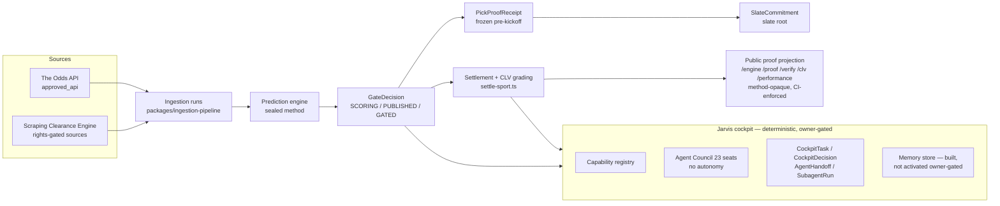
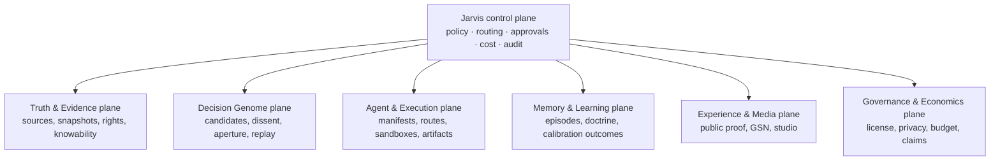

# 04 — Architecture

Two diagrams. The first is validated against code (CURRENT). The second is the
program's destination (TARGET) — nothing in it is claimed as built.

## CURRENT — governed decision spine (validated 2026-07-11)



Key invariant: everything public is an outcome or a commitment; the method
never crosses the projection boundary (pinned in `sealed-engine.test.ts`).

## TARGET — Galaxy Intelligence Fabric (design only)



The program's chain (each arrow already exists or is being built behind flags):

```
approved source → snapshot → evidence/claim → candidate ledger → Decision
Genome → dissent → aperture → sealed receipt → result → calibration →
reviewable memory → improved route/policy
```

## Workstream placement

| Workstream | Plane | Module |
|---|---|---|
| A Truth reconciliation | Governance | registry/docs/tests (done) |
| B R&D Radar | Governance + Truth | `lib/resource-intelligence/radar/` |
| C Agent Foundry | Agent & Execution | `lib/agent-foundry/` |
| D Setup Assurance | Governance | `lib/assurance/` |
| E Model Router (shadow) | Agent & Execution | `lib/ai-routing/` |
