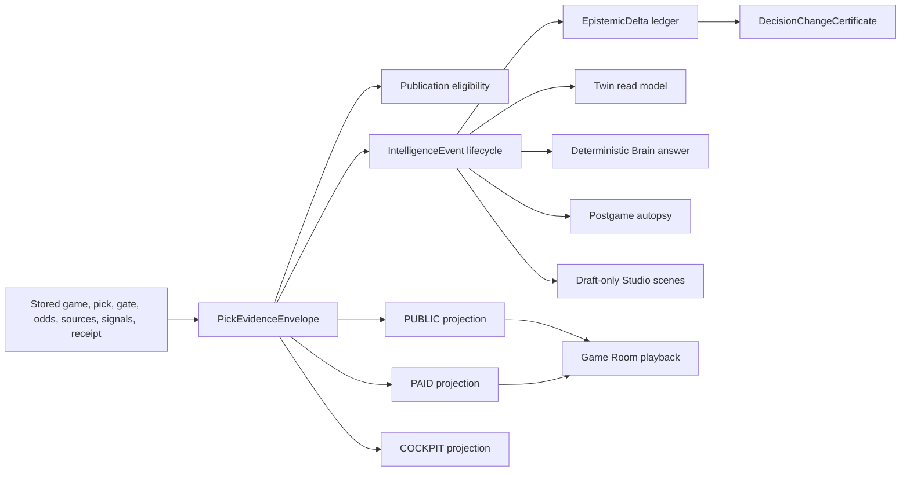

# Architecture and Decisions

## One truth, many projections

## Decisions

1. The immutable envelope is the truth object. Events, deltas, certificates, and consumer views are deterministic projections.
2. Canonical JSON sorts object keys and normalized evidence order before hashing. Input order cannot change the digest.
3. Missing facts are explicit `NOT_CAPTURED` states. Later prices, nearby scores, or inferred thresholds cannot fill historical gaps.
4. Publication requires captured required evidence, valid temporal bounds, exact proof/gate binding, bound active factors, fresh non-contradicted evidence, and a consistent stored decision.
5. Audience policy runs server-side. PUBLIC never receives movement/dispersion, paid factor trails, raw source payloads, or raw model output.
6. A decision explanation reports observed stored transitions only. Every delta says causality is not inferred.
7. Draft-only Media Studio output always blocks auto-publication and carries human-review, rights, freshness, health, contradiction, and publication gates.
8. Historical PASS rows with incomplete quote, threshold, or source bindings stay unavailable.
9. No second renderer-specific event truth may be persisted for Game Room, Twin, Brain, autopsy, or Studio.

## Persistence finding

Current `GateDecision` persistence lacks a complete immutable market/threshold snapshot and no reliable writer was found for the complete decision record. Pick-specific calibration effects are also absent. The additive proposal is in `docs/architecture/INTELLIGENCE_DECISION_PERSISTENCE_PROPOSAL.md`; it is proposal-only until explicit owner approval and shadow-DB proof.
